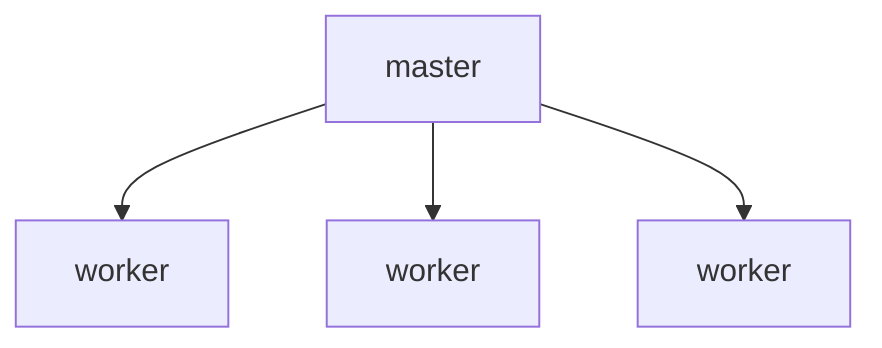

# Nginx 服务启停

## 一、Nginx 启动

Linux 系统中，在命令行输入：

````shell
nginx
````

启动成功后，在浏览器输入 `localhost`（默认 80 端口），查看 Nginx 的欢迎页面。

Nginx 启动成功后，会作为一个后台进程一直运行。

### 1.查看 Nginx 端口占用

在命令行，输入以下命令，查看 80 端口占用情况：

```shell
lsof -i :80
```

输出：

```shell
zetian@ZeTiandeMacBook-Pro ~ % lsof -i :80
COMMAND    PID   USER   FD   TYPE             DEVICE SIZE/OFF NODE NAME
Google    1546 zetian   28u  IPv4 0x6572c7c7276f9c0b      0t0  TCP localhost:49728->localhost:http-alt (CLOSED)
nginx     1812 zetian    6u  IPv4 0x6572c7c72771be73      0t0  TCP *:http-alt (LISTEN)
nginx     1813 zetian    6u  IPv4 0x6572c7c72771be73      0t0  TCP *:http-alt (LISTEN)
```

可以看到，80 端口，正被 Nginx 的两个进程占用。

### 2.查看 Nginx 进程

在命令行输入以下命令，查看 Nginx 进程：

```shell
ps -ef | grep nginx
```

输出：

```shell
zetian@ZeTiandeMacBook-Pro ~ % ps -ef|grep nginx
  501 11968     1   0  5:57下午 ??         0:00.00 nginx: master process nginx
  501 11969 11968   0  5:57下午 ??         0:00.00 nginx: worker process
  501 12154 10080   0  6:02下午 ttys013    0:00.00 grep nginx
```

第二列是 pid，即 Linux 系统中的进程 id。

关注前两个进程，即 master 进程，和 worker 进程。

Nginx 的进程模型



master 进程，就是 Nginx 的主进程。主要负责：

- 读取，验证配置文件。
- 管理 worker 进程。

worker 进程，就是 Nginx 的工作进程，主要负责：

- 处理实际的请求。

worker 进程的数量，可以通过配置文件来调整。

## 二、Nginx 停止

输入以下命令：

```shell
nginx -s [signal]
```

signal 可以是：

- quit：优雅停止（即等待所有现有连接处理完毕再关闭 Nginx）
- stop：立即停止
- reload：重载配置文件
- reopen：重新打开日志文件
