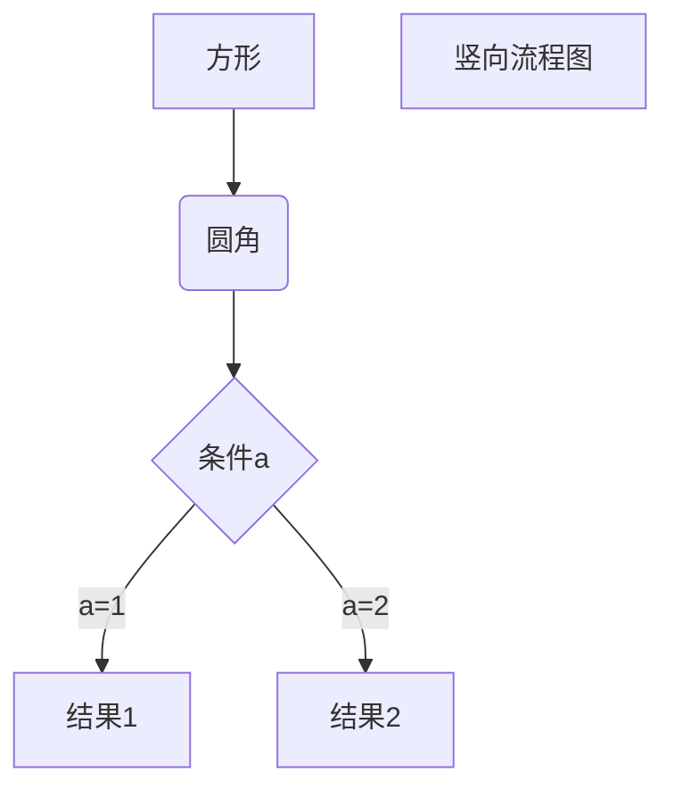

# Nginx 服务启停

## 一、Nginx 启动

在 Linux 系统中，在命令行输入：

````shell
nginx
````

启动成功后，在浏览器输入 `localhost`，查看 Nginx 的欢迎页面。

Nginx 启动成功后，会作为一个后台进程一直运行。

在命令行输入以下命令，查看 Nginx 进程：

```shell
ps -ef|grep nginx
```

输出

```shell
zetian@ZeTiandeMacBook-Pro ~ % ps -ef|grep nginx
  501 11968     1   0  5:57下午 ??         0:00.00 nginx: master process nginx
  501 11969 11968   0  5:57下午 ??         0:00.00 nginx: worker process
  501 12154 10080   0  6:02下午 ttys013    0:00.00 grep nginx
```

关注前两个进程，即 master 进程，和 worker 进程。

Nginx 的进程模型


