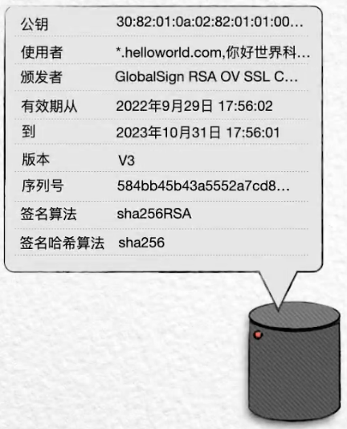
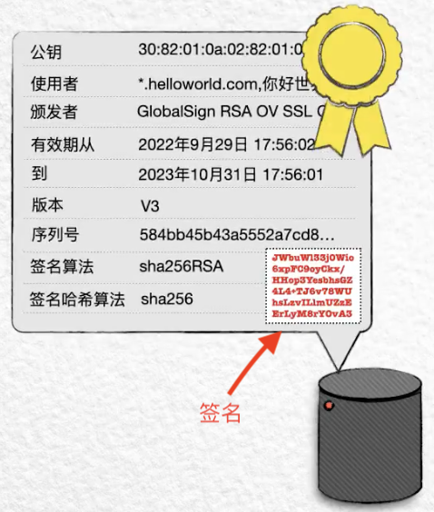

# HTTPS 技术鉴赏

[参考资料](https://www.bilibili.com/video/BV1uY4y1D7Ng)

## 1.HTTP 协议的缺陷

HTTP 以明文的形式传递信息。攻击者可以在信息传递的途中，轻松地实现信息的见查看和篡改。攻击者可以查看浏览器发送给服务器的帐号，密码等等信息，也可以查看到服务器发送给浏览器的定制版页面。

比如：早起网站上被网络运营商加入的狗皮膏药广告。

为了预防这种情况的出现，网景公司最早在自己的浏览器中，实现了 https 协议。它的原理，就是是用密钥对发送的信息进行加密和解密。

## 2.对称加密

加密者用密钥加密信息，得到密文；解密者用密钥解密信息，得到明文。这被称为“对称加密”。加密、解密都是用同一个密钥，互为逆向过程。

使用“对称加密”的方式，浏览器和服务器要协商出一个相同的密钥，且不能通过明文的方式互相发送（因为这很用可能会被攻击者拦截），所以只能在线下协商出一个相同的密钥。这显然是不合理的。

## 3.非对称加密

所以，更为实际的办法，是使用“非对称加密”。在“非对称加密”中，密钥总是成对出现，分别称之为“公钥”和“私钥”。

- “公钥”加密的数据，只能被“私钥”解密，“公钥”自身也无法解密。常用于加密信息。
- “私钥”加密的数据，只能被“公钥”解密，“私钥”自身也无法解密。常用来验证身份。

也就是说，“非对称加密”的加、解密的过程，并不对称。

## 4.SSL 握手

这样，服务器将自己的公钥，发给浏览器（客户端），浏览器生成一个随机数据，用服务器的公钥加密，再发送给服务器，服务器再用自己的私钥解密，如此双方就得到了一个同样的随机数据。这个随机数据，便可以作为对称加密的密钥，对真正要传递的数据，进行加密。

总结：使用非对称加密，协商出一个相同的密钥，然后用这个密钥，进行堆成加密传输正式数据。这就是 HTTPS 协议中，“S”的大致原理。这是一套独立于 HTTP 协议的流程，也被称为安全套接字层（Secure Socket Layer），简称 SSL。这个密钥协商的过程，也被称为 SSL 握手。

## 5.SSL 的历史

1. 1994 年，SSL 1.0 发布。
2. 1995 年，SSL 2.0 发布。
3. 1996 年，SSL 3.0 发布。
4. 1999 年，TSL 1.0 发布，它被互联网工程事物组（IETF）基于 SSL3.0 进行了标准化，所以 TSL 1.0 常常被称作 SSL 3.1，
5. 2006 年，TSL 1.1 发布。
6. 2008 年，TSL 1.2 发布。
7. 2018 年，TSL 1.3 发布。

TSL 升级的内容，主要是对安全细节的改善，比如：随着 MD5 和 SHA-1 逐渐丧失安全性，TSL 1.2 升级的主要内容就包括淘汰这两个哈希函数，而用 SHA-256 取而代之。

## 6.CA 机构

问题似乎得到了解决，但仍然存在棘手的问题。

1. 如果攻击者在服务器传递公钥给浏览器的过程中，将服务器的公钥拦截，并替换成自己的公钥，发送给浏览器。
2. 浏览器收到后，无法知道这个公钥是否被篡改过，仍然用这个公钥加密作为后续对称加密密钥的随机数据。
3. 攻击者拦截到浏览器加密的随机数据后，用自己的私钥解密该随机数据，再用服务器的公钥加密该随机数据，再发送给服务器，
4. 服务器再用自己的私钥解密随机数据。

上面的过程中，攻击者就像一个黑中介，两头骗。这样，虽然通信的双方协商出了对称加密的密钥，但攻击者也知道了。所以接下来的加密毫无意义。

问题的根本在于，公钥并不能表明自己属于谁，所以解决的方式就是让其具有表明自己身份的能力。

这就需要引入一个第三方角色 CA（Certificate Authority） 机构。

现在，服务器将会把自己的公钥、域名、组织名、所申请的 CA 机构名....信息放在一起，形成一个数据集合。

将这个数据集合，提供给 CA 机构，CA 机构有自己的公、私钥对，它会先对服务器提供的信息，进行哈希运算（如 SHA256），得到一串哈希值。然后再用自己的私钥加密哈希值，得到一个密文，这被称为“**签名**”。

然后把签名和原始明文放在一起，提供给服务器的管理员。这就是所谓的 TSL 证书。

现在，服务器传递给浏览器的，不再是自己的公钥，而是这个能够表明自己身份的 TSL 证书。

浏览器拿到这个 TSL 证书后，需要先进行验证，方法就是拿 CA 机构公开的公钥，对证书中的密文进行解密，得到服务器信息的哈希值：

- 如果解密的哈希值结果，与证书中的明文通过指定的哈希算法生成的哈希值一致，则通过验证。然后才会从证书中提取服务器的公钥。加密后续用于对称加密的随机数据，发送给服务器。
- 否则浏览器就会显示网站不安全的风险提示。

现在，原则上来说，中间的攻击者将再也没有进行欺骗的可能。

- 如果攻击者拦截服务器的 TSL 证书后，将其中的公钥篡改为自己的，再发送给浏览器；那么浏览器使用 CA 机构公钥解密证书中的签名，就会发现解密之后的公钥部分，和篡改后的公钥对不上。
- 如果攻击者在 CA 机构也申请了一个 TSL 证书，并在拦截服务器的 TSL 证书后，替换为自己的 TSL 证书，发送给浏览器；那么浏览器使用 CA 机构公钥解密证书中的签名，就会发现公钥是可以对应上，但证书中的域名和浏览器正在访问的域名又对应不上了。

在这套证书机制中，CA 机构显得至关重要。常见的 CA 机构有：

- Microsoft
- Google
- Symantec（赛门铁克）
- GlobalSign
- CNNIC（中国互联网络信息中心）
- CFCA（中国金融认证中心）

浏览器会在系统内置中，查找受信任的 CA 机构？

- Windows 上可在 internet 的属性中找到它们。
- 火狐浏览器的【设置 -> 隐私与安全】中找到它们。
